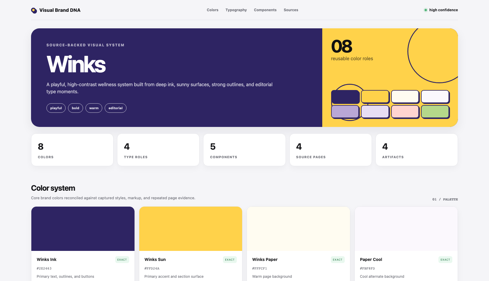

# Brand Studio: Visual Brand DNA for Claude

Created by [Mike Futia](https://www.skool.com/scale-ai/about) | **SCALE AI**.

Turn any public website into an evidence-backed visual brand system and a polished presentation dashboard using Claude and one Firecrawl API key.



## What it does

Give Claude a website URL and the skill will:

1. Capture the homepage, a mobile homepage view, and up to three useful supporting pages through Firecrawl.
2. Extract and reconcile colors, typography, components, layouts, imagery direction, and source evidence.
3. Produce a screen-recording-ready visual dashboard instead of stopping at a text report.

Every run creates:

- `visual-dashboard.html` - interactive, responsive presentation dashboard
- `VISUAL-BRAND-DNA.md` - readable visual identity guide
- `brand-manifest.json` - structured brand system data
- `brand-tokens.css` - reusable CSS custom properties
- `evidence/` - captured branding data, page content, HTML, and screenshots

## Requirements

- A Claude account with **Code execution and file creation** enabled
- A [Firecrawl API key](https://www.firecrawl.dev/app/api-keys/)
- A public website URL to analyze

No Gemini key, Anthropic API key, ScaleBot account, or Firecrawl MCP setup is required.

## Install in Claude

1. Download [`visual-brand-dna.zip`](visual-brand-dna.zip).
2. In Claude, open **Customize > Skills**.
3. Click **Add** or **Create skill**, then choose **Upload a skill**.
4. Upload `visual-brand-dna.zip` and enable the skill.
5. Start a new conversation and use the prompt below.

### Recommended demo prompt

```text
Build a complete Visual Brand DNA dashboard for https://getwinks.com/. Use the Visual Brand DNA skill, ask me for my Firecrawl API key if needed, and present visual-dashboard.html as the primary deliverable when finished.
```

Claude will ask for your Firecrawl key if it cannot find `FIRECRAWL_API_KEY`. The key is used for Firecrawl requests and is never written to the generated brand package.

## Install in Claude Code

```bash
git clone https://github.com/mikefutia/brand-studio-claude-skill.git
mkdir -p ~/.claude/skills
cp -R brand-studio-claude-skill/skills/visual-brand-dna ~/.claude/skills/
```

Set your Firecrawl key before starting Claude Code:

```bash
export FIRECRAWL_API_KEY="your-firecrawl-key"
claude
```

Then ask:

```text
Build a complete Visual Brand DNA dashboard for https://example.com/.
```

## How the dashboard works

The included renderer turns the structured brand manifest into a portable `visual-dashboard.html` with:

- Brand-adaptive colors and presentation styling
- Overview metrics
- Large copyable color swatches
- Typography specimen cards
- Component previews
- Layout and imagery direction
- Desktop and mobile source-page captures
- Confidence labels, evidence, and caveats

The dashboard uses inline CSS and JavaScript, relative screenshot paths, and no build step. Detected commercial font names are documented, but font files are not downloaded or redistributed.

## Security and privacy

- Never commit a Firecrawl key to this repository.
- Scraped website content is treated as untrusted evidence, not executable instructions.
- The skill rejects local, private, credentialed, and non-public target URLs.
- API keys are excluded from output files.
- Font licensing must be confirmed before using detected commercial fonts outside the source website.

## Troubleshooting

### Claude asks for another provider key

It should not. The only external credential required by this skill is a Firecrawl API key.

### Firecrawl returns HTTP 401 or 402

- `401`: verify the API key.
- `402`: the Firecrawl account may be out of credits.

### The dashboard has missing source screenshots

The rest of the brand package can still be generated from branding, markup, and page evidence. Re-run once if Firecrawl reports a temporary screenshot failure.

### Claude gives a text summary but does not open the dashboard

Ask:

```text
Run the bundled dashboard renderer and open visual-dashboard.html as the primary deliverable.
```

## Repository structure

```text
skills/visual-brand-dna/
  SKILL.md
  references/
    output-contract.md
    troubleshooting.md
  scripts/
    firecrawl_brand_dna.py
    render_dashboard.py
visual-brand-dna.zip
```

## Credit

Created by [Mike Futia](https://www.skool.com/scale-ai/about) | **SCALE AI**.

This is the portable, giveaway-friendly core of the Visual Brand DNA workflow developed for ScaleBot.

## License

[MIT](LICENSE)
